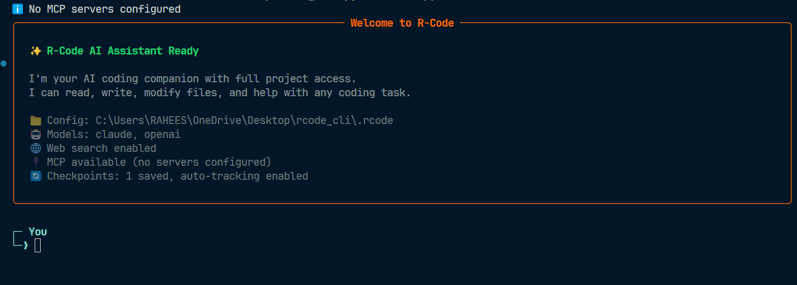

# R-Code CLI

> **AI-Powered Interactive Code Assistant**



rcode is an intelligent CLI tool that provides an interactive chat interface powered by Claude AI for code generation, fixing, and assistance. Simply chat with the AI about your code needs in natural language.

## 🚀 Key Features

- **Interactive Chat Interface**: Natural language conversations with AI
- **Project Context Awareness**: Automatically understands your project structure
- **Time Travel System**: Built-in checkpoints and undo functionality
- **Streaming Responses**: Real-time AI responses
- **Slash Commands**: Quick actions like /help, /undo, /revert

## 📋 Prerequisites

- Node.js 18.0.0 or higher
- Anthropic API key (Claude access)

## 🛠️ Installation

### 1. Set Your API Key

**Before installation**, export your Anthropic API key:

```bash
# Windows (Command Prompt)
set ANTHROPIC_API_KEY=your-api-key-here

# Windows (PowerShell)
$env:ANTHROPIC_API_KEY="your-api-key-here"

# macOS/Linux
export ANTHROPIC_API_KEY=your-api-key-here
```

Or create a `.env` file in your project:

```
ANTHROPIC_API_KEY=your-api-key-here
```

### 2. Install R-Code

```bash
# Clone and install
git clone https://github.com/RaheesAhmed/R-Code.git
cd R-Code


```

## 🎮 Usage

### Start Interactive Chat

```bash
# Simply run rcode (defaults to chat mode)
rcode

# Or explicitly use chat command
rcode chat
# or shorthand
rcode c
```

### Chat Interface

Once in chat mode, you can:

- **Ask questions**: "How do I create a React component?"
- **Request code**: "Create a login form with validation"
- **Get help**: Type `/help` for available commands
- **Undo changes**: Type `/undo` to reverse last operation
- **View checkpoints**: Type `/checkpoints` to see save points
- **Revert changes**: Type `/revert <checkpoint-id>` to go back
- **Check status**: Type `/status` for session info
- **Exit**: Type `exit` or `quit` to close

### Example Session

```
$ rcode

Welcome to R-CODE
  Type your message below. Use "exit" to quit.
  Type "/help" to see available commands.

› /undo

Successfully undid last operation!

› exit
Goodbye!
```

## 🔧 Available Slash Commands

| Command        | Description                     |
| -------------- | ------------------------------- |
| `/help`        | Show available commands         |
| `/undo`        | Undo the last operation         |
| `/revert <id>` | Revert to a specific checkpoint |
| `/checkpoints` | List all available checkpoints  |
| `/status`      | Show current session status     |

## 🛡️ Project Structure

The tool automatically analyzes your project context including:

- File structure and organization
- Dependencies and frameworks used
- Existing code patterns and conventions
- Git history and changes

## 🐛 Troubleshooting

### API Key Issues

```bash
# Check if your API key is set
echo $ANTHROPIC_API_KEY  # Linux/macOS
echo %ANTHROPIC_API_KEY% # Windows CMD
```

## 📄 License

MIT License - see [LICENSE](LICENSE) file for details.

## 📞 Support

- 🐛 Issues: [GitHub Issues](https://github.com/RaheesAhmed/R-Code/issues)
- 📧 Email: raheesahmed37@gmail.com

---

**Simple. Powerful. Just chat with AI about your code.**

[](https://nodejs.org/)
[](https://anthropic.com)
